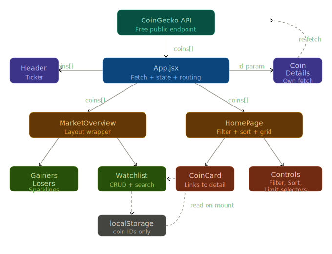
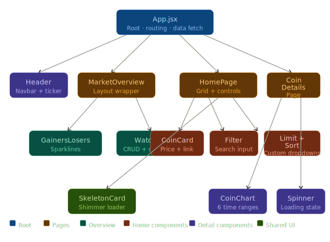

<div align="center">

# 🪙 CryptoTracker

### A sleek, real-time cryptocurrency dashboard built with React & CoinGecko API

[](https://react.dev)
[](https://vitejs.dev)
[](https://www.chartjs.org)
[](https://www.coingecko.com/en/api)
[](LICENSE)

<br/>

> Track live crypto prices, analyze charts, and manage your personal watchlists — all in one place.

</div>

---

## ✨ Features

| Feature | Description |
|---|---|
| 📊 **Live Prices** | Real-time data from CoinGecko API |
| 📈 **Top Gainers & Losers** | See the best and worst performers with sparklines |
| 🔍 **Filter & Sort** | Search by name/symbol, sort by price, market cap or 24h change |
| ⭐ **Watchlists** | Create up to 5 personal watchlists with 3 coins each |
| 📉 **Interactive Charts** | 6 time ranges — 1D, 7D, 1M, 3M, 6M, 1Y |
| 🎰 **Live Ticker** | Scrolling ticker bar with real-time prices |
| 📱 **Fully Responsive** | Works on mobile, tablet and desktop |

---

## 🖥️ Pages

```
/           → Home (Gainers/Losers + Watchlist + Coin Grid)
/coin/:id   → Coin Detail Page (stats + interactive chart)
/about      → About Page
/*          → 404 Not Found
```

---

## 🏗️ Project Structure

```
src/
├── components/
│   ├── CoinCard.jsx          # Individual coin card
│   ├── CoinChart.jsx         # Interactive price chart (6 ranges)
│   ├── FilterInput.jsx       # Search/filter input
│   ├── GainersLosers.jsx     # Top gainers & losers with sparklines
│   ├── Header.jsx            # Navbar + live ticker
│   ├── LimitSelector.jsx     # Coins per page selector
│   ├── MarketOverview.jsx    # Layout wrapper
│   ├── SkeletonCard.jsx      # Shimmer loading placeholder
│   ├── SortSelector.jsx      # Sort dropdown
│   ├── Spinner.jsx           # Loading spinner
│   └── Watchlist.jsx         # Full watchlist CRUD
│
├── pages/
│   ├── home.jsx              # Home page
│   ├── coin-details.jsx      # Coin detail page
│   ├── about.jsx             # About page
│   └── not-found.jsx         # 404 page
│
├── App.jsx                   # Root: routing + data fetching
├── main.jsx                  # Entry point
└── index.css                 # Global styles
```

---

## 🔄 Data Flow


---
## 📦 Component Architecture


---
## ⚙️ Tech Stack

| Layer | Technology |
|---|---|
| ⚛️ Framework | React 18 + Vite |
| 🗺️ Routing | React Router v7 |
| 📊 Charts | Chart.js + react-chartjs-2 |
| ✨ Sparklines | react-sparklines |
| 🎨 Icons | Lucide React |
| 🌐 Data | CoinGecko Public API |
| 💾 Persistence | localStorage (watchlists) |
| 🎨 Styling | Pure CSS with CSS Variables |

---

## 🚀 Getting Started

### Prerequisites
- Node.js 18+
- A free [CoinGecko API key](https://www.coingecko.com/en/api) (optional for demo endpoint)

### Installation

```bash
# 1. Clone the repo
git clone https://github.com/nilesh65/crypto-tracker.git
cd crypto-tracker

# 2. Install dependencies
npm install

# 3. Create environment file
cp .env.example .env
```

### Environment Variables

Create a `.env` file in the root:

```env
VITE_API_URL=https://api.coingecko.com/api/v3/coins/markets?vs_currency=usd
VITE_COIN_API_URL=https://api.coingecko.com/api/v3/coins
```

```bash
# 4. Start development server
npm run dev
```

Open [http://localhost:5173](http://localhost:5173) 🎉

---

## 🌐 API Reference

This project uses the **CoinGecko Public API** (no key required for basic usage).

| Endpoint | Used For |
|---|---|
| `/coins/markets` | Home page coin list with sparklines |
| `/coins/{id}` | Coin detail page (description, stats, links) |
| `/coins/{id}/market_chart` | Price chart data (1D to 1Y) |

> ⚠️ CoinGecko free tier has rate limits (10–30 calls/min). If you see errors, wait a moment and refresh.

---

## 📱 Responsive Breakpoints

| Breakpoint | Layout |
|---|---|
| `> 1100px` | Full 2-column overview grid |
| `≤ 1100px` | Stacked single column |
| `≤ 900px` | Compact rows, hidden sparklines |
| `≤ 600px` | Full mobile — single column cards, stacked controls |

---

## 🔮 Future Improvements

- [ ] Portfolio tracker with P&L
- [ ] Price alerts / notifications
- [ ] Dark / Light theme toggle
- [ ] Pagination instead of limit selector
- [ ] Unit tests with Vitest
- [ ] PWA support for offline use

---

## 📄 License

This project is licensed under the **MIT License** — see [LICENSE](LICENSE) for details.

---

<div align="center">

Made with ❤️ and ☕ using React & CoinGecko API

⭐ **Star this repo if you found it useful!**

</div>
